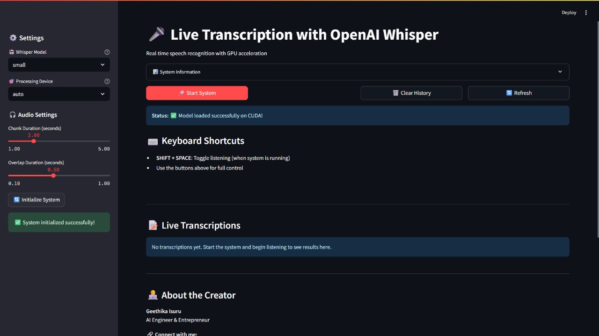

# 🎤 Whisper Live Transcription

[](https://www.python.org/downloads/)
[](LICENSE)
[](https://streamlit.io/)
[](https://github.com/openai/whisper)
[](https://github.com/SYSTRAN/faster-whisper)
--

--


Real-time speech transcription using **OpenAI Whisper** and **Faster-Whisper** with both command-line and web interfaces. Features GPU acceleration, multiple model options, up to 4x faster processing, and an intuitive Streamlit web UI.

## ✨ Features

### 🚀 Dual Whisper Implementation Support
- **⚡ Faster-Whisper (Recommended)**: Up to 4x faster with CTranslate2 optimization
- **🤖 OpenAI Whisper**: Original implementation for full compatibility

### 🎯 Core Features
- 🎯 **Real-time transcription** with both Whisper implementations
- 🚀 **GPU acceleration** support (CUDA) with FP16 and INT8 quantization
- 🌐 **Web interface** (Streamlit) and command-line interface
- 🎛️ **Multiple Whisper models** including distil-large-v3 and large-v3
- 🔊 **Voice Activity Detection (VAD)** - Automatic silence filtering
- 🎤 **Audio device selection** with automatic detection
- ⌨️ **Keyboard shortcuts** (SHIFT + SPACE to toggle)
- 📊 **Live status updates** and transcription history
- 🔄 **Automatic fallback** from GPU to CPU
- 🐳 **Docker support** for easy deployment
- 📦 **Multiple installation** options

## 🚀 Quick Start

### Option 1: One-liner Install (Linux/macOS)
```bash
curl -sSL https://raw.githubusercontent.com/geethikaisuru/whisper-live-transcription/main/install.sh | bash
```

### Option 2: Manual Installation
```bash
# Clone the repository
git clone https://github.com/geethikaisuru/whisper-live-transcription.git
cd whisper-live-transcription

# Install dependencies (includes both Whisper implementations)
pip install -r requirements_streamlit.txt

# Test Faster-Whisper installation (optional)
python install_faster_whisper.py

# Run the Streamlit app
python run_streamlit.py
```

### Option 3: Docker
```bash
# Quick start with Docker
docker run -p 8501:8501 --device /dev/snd geethikaisuru/whisper-live-transcription

# Or build locally
docker-compose up
```

### Option 4: PyPI Package (Coming Soon)
```bash
pip install whisper-live-transcription
whisper-live  # Start web interface
whisper-cli   # Start command-line interface
```

## 📋 Interface Options

### 🌐 Streamlit Web Interface
- Modern, intuitive web UI
- Real-time transcription display
- Visual controls and settings
- Device selection interface
- Transcription history

**Launch:** `python run_streamlit.py` or `streamlit run streamlit_transcription.py`

### 💻 Command Line Interface
- Terminal-based interface
- Keyboard hotkey controls
- Optimized for power users
- Minimal resource usage

**Launch:** `python live_transcription.py`

## 🔧 System Requirements

### Minimum Requirements
- Python 3.8+
- 4GB RAM
- Microphone input
- Internet connection (for initial model download)

### Recommended for GPU Acceleration
- NVIDIA GPU with CUDA support
- 6GB+ VRAM (for medium/large models)
- CUDA Toolkit installed
- PyTorch with CUDA support

## ⚙️ Configuration

### Whisper Models
| Model | Size | Speed | Accuracy | VRAM | Best For |
|-------|------|-------|----------|------|----------|
| tiny | 32MB | Very Fast | Basic | <1GB | Quick testing |
| base | 74MB | Fast | Good | ~1GB | Basic transcription |
| small | 244MB | Medium | Very Good | ~2GB | General use |
| medium | 769MB | Slower | Excellent | ~4GB | RTX 4050 |
| large | 1550MB | Slow | Best | ~8GB | High-end GPUs |
| turbo | 809MB | Fast | Excellent | ~4GB | Balanced option |

### Recommended Settings
- **RTX 4050 (6GB VRAM)**: medium model, CUDA, 2-3s chunks
- **Lower-end systems**: small/base model, CPU, 3-5s chunks
- **Best accuracy**: large model, good microphone, minimal background noise

## 🎮 Controls

### Web Interface
- **🚀 Start System**: Initialize audio capture
- **🔴 Start Listening**: Begin recording and transcription
- **⏸️ Pause Listening**: Pause transcription
- **⏹️ Stop System**: Stop all processes
- **🗑️ Clear History**: Clear transcription history

### Keyboard Shortcuts
- **SHIFT + SPACE**: Toggle listening (both interfaces)
- **ESC**: Quit application (CLI only)

## 🐳 Docker Deployment

### Standard Version
```bash
docker-compose up whisper-transcription
```

### GPU Version
```bash
docker-compose --profile gpu up whisper-transcription-gpu
```

### Custom Build
```bash
docker build -t whisper-transcription .
docker run -p 8501:8501 --device /dev/snd whisper-transcription
```

## ☁️ Cloud Deployment

### Streamlit Cloud (Free)
1. Fork this repository
2. Go to [share.streamlit.io](https://share.streamlit.io)
3. Connect your GitHub repository
4. Deploy with one click

### Other Platforms
- **Heroku**: Use included `Procfile`
- **Google Cloud Run**: Deploy with `gcloud run deploy`
- **AWS ECS**: Use Docker image
- **DigitalOcean**: App Platform integration

## 🛠️ Development

### Local Development Setup
```bash
# Clone and setup
git clone https://github.com/geethikaisuru/whisper-live-transcription.git
cd whisper-live-transcription

# Create virtual environment
python -m venv venv
source venv/bin/activate  # On Windows: venv\Scripts\activate

# Install dependencies
pip install -r requirements_streamlit.txt

# Run in development mode
streamlit run streamlit_transcription.py --reload
```

### Project Structure
```
whisper-live-transcription/
├── streamlit_transcription.py    # Streamlit web app
├── live_transcription.py        # Command-line interface
├── requirements_streamlit.txt    # Dependencies
├── Dockerfile                   # Container configuration
├── docker-compose.yml           # Docker orchestration
├── run_streamlit.py             # Launch script
├── install.sh                   # Installation script
└── docs/                        # Documentation
```

## 🔗 API Integration

The transcription engine can be integrated into other applications:

```python
from streamlit_transcription import StreamlitLiveTranscriber

# Initialize transcriber
transcriber = StreamlitLiveTranscriber(
    model_name="small",
    device="auto"
)

# Load model
transcriber.load_model()

# Start transcription
transcriber.start_transcription()
```

## 🤝 Contributing

We welcome contributions! Please see our [Contributing Guidelines](CONTRIBUTING.md) for details.

### Quick Contribution Setup
1. Fork the repository
2. Create a feature branch
3. Make your changes
4. Add tests if applicable
5. Submit a pull request

## 📊 Performance Benchmarks

| System | Model | Device | Processing Time | Accuracy |
|--------|-------|--------|----------------|----------|
| RTX 4050 | medium | CUDA | ~0.8s/2s audio | 95%+ |
| RTX 4050 | large | CUDA | ~1.2s/2s audio | 98%+ |
| CPU i7 | small | CPU | ~2.5s/2s audio | 92%+ |
| CPU i5 | base | CPU | ~1.8s/2s audio | 88%+ |


## 🐛 Troubleshooting

### Common Issues

**"No audio devices found"**
- Check microphone permissions
- Ensure microphone is connected
- Try different audio device

**"CUDA not available"**
- Install NVIDIA drivers
- Install CUDA Toolkit
- Install PyTorch with CUDA support

**Model loading errors**
- Check internet connection
- Try smaller model first
- Clear model cache

See [README_Streamlit.md](README_Streamlit.md) for detailed troubleshooting.

## 📄 License

This project is licensed under the MIT License - see the [LICENSE](LICENSE) file for details.

## 👨‍💻 About the Creator

**Geethika Isuru** - AI Engineer & Entrepreneur

*"Trying to make a better world with AI"*

- 💼 [LinkedIn Profile](https://www.linkedin.com/in/geethikaisuru/)
- 📂 [GitHub Profile](https://github.com/geethikaisuru)
- 🖥️ [Official Website](https://geethikaisuru.com)

## 🙏 Acknowledgments

- OpenAI for the incredible Whisper model
- Streamlit team for the amazing framework
- The open-source community for inspiration and support
- ⚠️ **Note:** The underlying Whisper Model is made by OpenAI and is open source with MIT License. I only made the frontend to easily use that model.
- [OpenAI Whisper](https://github.com/openai/whisper) 

## ⭐ Star History

If this project helped you, please consider giving it a star! ⭐

[](https://star-history.com/#geethikaisuru/whisper-live-transcription&Date)

